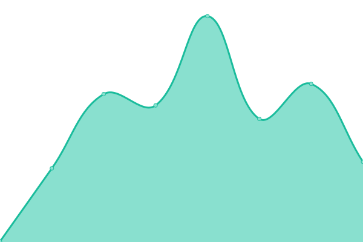
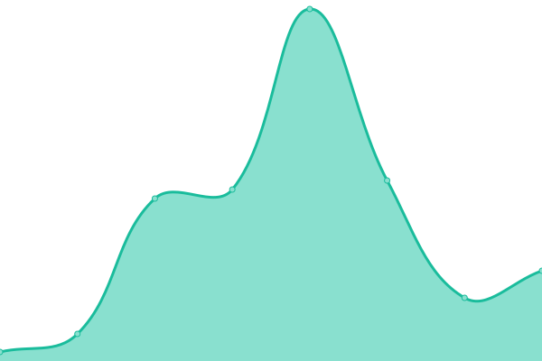

# [📈 Live Status](https://status.papurika.eu): <!--live status--> **🟧 Partial outage**

This repository contains the open-source uptime monitor and status page for [papurika-eu](https://status.papurika.eu), powered by [Upptime](https://github.com/upptime/upptime).

With [Upptime](https://upptime.js.org), you can get your own unlimited and free uptime monitor and status page, powered entirely by a GitHub repository. We use [Issues](https://github.com/papurika-eu/uptime-papurika/issues) as incident reports, [Actions](https://github.com/papurika-eu/uptime-papurika/actions) as uptime monitors, and [Pages](https://status.papurika.eu) for the status page.

<!--start: status pages-->
<!-- This summary is generated by Upptime (https://github.com/upptime/upptime) -->
<!-- Do not edit this manually, your changes will be overwritten -->
<!-- prettier-ignore -->
| URL | Status | History | Response Time | Uptime |
| --- | ------ | ------- | ------------- | ------ |
|  [Redirection](https://papurika.eu) | 🟩 Up | [redirection.yml](https://github.com/papurika-eu/uptime-papurika/commits/HEAD/history/redirection.yml) | 

 394ms
     
 | 

<a href="https://status.papurika.eu/history/redirection">100.00%</a>
    

|  [Homepage](https://www.papurika.eu) | 🟩 Up | [homepage.yml](https://github.com/papurika-eu/uptime-papurika/commits/HEAD/history/homepage.yml) | 

 26ms
     
 | 

<a href="https://status.papurika.eu/history/homepage">100.00%</a>
    

|  [Opus](https://opus.papurika.eu) | 🟥 Down | [opus.yml](https://github.com/papurika-eu/uptime-papurika/commits/HEAD/history/opus.yml) | 

 0ms
     
 | 

<a href="https://status.papurika.eu/history/opus">0.00%</a>
    

|  [Thot](https://thot.papurika.eu) | 🟥 Down | [thot.yml](https://github.com/papurika-eu/uptime-papurika/commits/HEAD/history/thot.yml) | 

 0ms
     
 | 

<a href="https://status.papurika.eu/history/thot">0.00%</a>
    

<!--end: status pages-->

[**Visit our status website →**](https://status.papurika.eu)

## 📄 License

- Powered by: [Upptime](https://github.com/upptime/upptime)
- Code: [MIT](./LICENSE) © [papurika-eu](https://status.papurika.eu)
- Data in the `./history` directory: [Open Database License](https://opendatacommons.org/licenses/odbl/1-0/)
